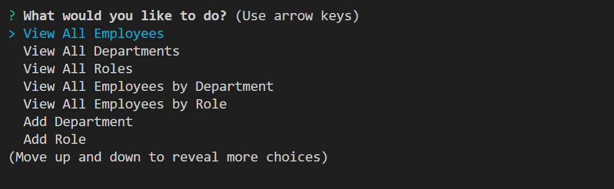

# Employee-Tracker-by-Jemima-Siddiqui

## Description
This project consists of a command-line application that can be used to manage a company's employee database, using Node.js, Inquirer, and MySQL. This application is a form of a content management systems (CMS) interface. 

## Table of Contents
* [Installation](#installation)
* [Usage](#usage)
* [Questions](#questions)

## Installation

### Downloading Visual Studio Code 

 Download the latest version of Visual Studio to your local machine (Mac, Linux or Windows). Please use the following link to download the latest version of VS Code [Download VS Code](https://code.visualstudio.com/download). 

### Pulling the repository from Git 

If you would like to acess the source code, please navigate to the following public Github repository [Github Repository](https://github.com/JemimaSiddiqui/Employee-Tracker-by-Jemima-Siddiqui.git). 

* Clone the repository to your local desktop using the following steps:

  * 🔑 Use the terminal command `cd` to navigate to the directory where we want the repository located. In this case, we will save it to the Desktop. 

  ```bash
  cd Desktop
  ```

  * 🔑 Use the git command `git clone` followed by the URL copied from Github to clone the repo to our local machine.

  ```bash
  git clone <url>
  ```

  * 🔑 Use the `git clone` command creates a new directory with the same name as the repository. We navigate into our new directory using `cd`.

  ```bash
  cd Employee-Tracker-by-Jemima-Siddiqui
  ```
* After the repository has been cloned to your local machine, open the files using Visual Studio application. 

## Usage
* In order to see a demonstration of this application, navigate to the following link: [https://www.youtube.com/watch?v=avBtfunaeW0](https://www.youtube.com/watch?v=avBtfunaeW0). 
* In order to see a demonstrtation of the bonus activity, navigate to the following link: [https://www.youtube.com/watch?v=ZMfa-MtrSI0](https://www.youtube.com/watch?v=ZMfa-MtrSI0).

* Step 1: Change into the directory of the application 
* Step 2: Run by using the following command in the command terminal in VS Code. 

  ```bash
  node index.js 
  ```
* Step 3: You will be presented with a question that asks you to choose an action/option. Please answer this question. 



* Step 4: Based on the option you choose you will either be presented with a table (for all the "view" options) or be asked a series of follow up questions (for all the "add" and "update" options). 
    
## Questions
Author: [JemimaSiddiqui](https://github.com/JemimaSiddiqui)

If you have any further questions, please feel free to contact me at: [jemimasiddiqui12@gmail.com](mailto:jemimasiddiqui12@gmail.com)
